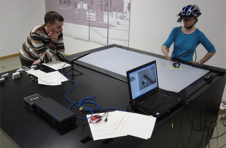
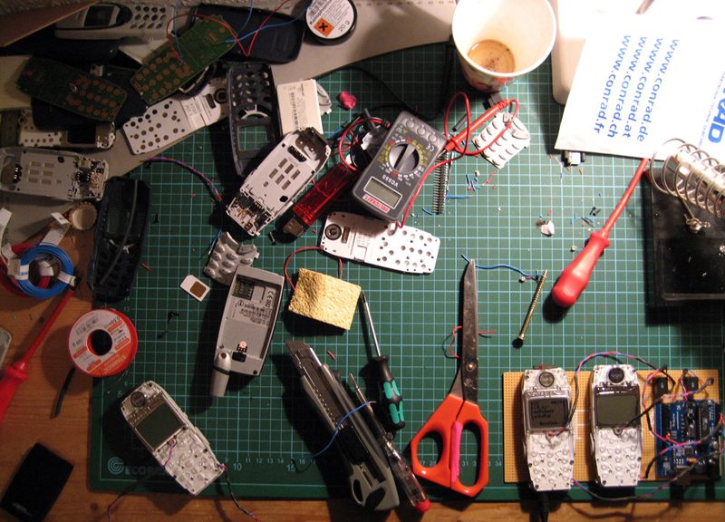

Im <strong>IDL // Interaction Design Lab</strong> kooperieren Senior Interaction Designer_innen und User Experience Professionals mit langjähriger Erfahrung im Agenturkontext und Projektmanagement mit Master- und PhD-Studierenden unserer Designstudiengänge. Die Professor_innen des Interfacedesign-Programms der FHP agieren in wechselnden Rollen als Projektleiter_innen und/oder Senior Consultants.

Das <strong>IDL // Interaction Design Lab</strong> begleitet mit seinen Forschungs- und Entwicklungsvorhaben den digitalen Wandel und nimmt dabei stets die Perspektive der Nutzerinnen und Nutzer ein. Anforderungen und Wünsche, aber auch Skepsis und Ängste gegenüber neuen digitalen Lebenswelten auf der einen Seite und aktuelle technologische Entwicklungen und rasant wachsende digitale Datenbestände auf der anderen Seite stellen den Ausgangspunkt der Forschungsarbeiten dar.

Mit Methoden des Human-Centered Designs werden Prototypen in einem iterativen, häufig partizipativen Prozess entwickelt und getestet sowie – wenn gewünscht – realisiert. Für die Evaluation steht ein State-of-the-Art Usability/UX-Lab mit stationären und mobilen Eye Trackern zur Verfügung. Das IDL verfügt über ein weit gespanntes Netz von renommierten Kooperationspartnern aus Forschung und Wirtschaft, die je nach Aufgabenstellung in die Projekte integriert werden.

Die Anwendungsfelder der Forschungs- und Entwicklungsarbeiten im IDL sind vielfältig. Sie umfassen das gesamte Spektrum mobiler, responsiver Anwendungen auf kleinen und kleinsten Displays und Wearables, Inhouse-Software diverser Branchen sowie großformatige Anwendungen auf interaktiven Tischen und Wall Displays. Letztere werden sowohl für den professionellen Einsatz im Kontext des Katastrophenmanagements oder von urbanen Planungs- und Entwicklungsprozessen als auch für museale Inszenierungen erforscht und evaluiert.

In der Auftragsforschung hat sich in den letzten Jahren ein thematischer Schwerpunkt in den Bereichen e-Government &amp; Open Data Portal (z.B. Umweltbundesamt, Polizei Brandenburg, Fraunhofer Fokus) sowie Science Communication &amp; Visual Storytelling (z.B. Deutsches Archäologisches Institut, Helmholtz-Gemeinschaft, Institute for Advanced Sustainability Studies) herausgebildet. Ziel dieser Projekte ist die Konzeption und Gestaltung attraktiver Daten- und Informationsportale, die für verschiedene Nutzergruppen staatliche Daten bzw. Daten von Forschungseinrichtungen in Kombination mit Social Media Daten in Form von interaktiven Karten und Grafiken aufbereiten sowie Daten zur Weiterverarbeitung in Anwendungen Dritter zur Verfügung stellen.

Im Bereich der hoheitlichen Forschung werden aktuell Projekte zu innovativen Formen der Mensch-Computer Interaktion auf großformatigen Multi-Touch-Tischen für das Katastrophenmanagement durchgeführt sowie Dashboards und Informationsvisualisierungen für IT-Security-Anwendungen konzipiert.

Weitere Forschungsschwerpunkte, die unter dem Label Sustainable Interaction Design zusammengefasst werden, adressieren die Transformation hin zu stärker nachhaltigen Lebens- und Arbeitsweisen. Die mehrfach ausgezeichnete mobile App EcoChallenge steht beispielhaft für transformationale Produkte, welche&nbsp;Nutzerinnen und Nutzer neben Informationen zu einem umweltfreundlichen Verhalten Aufgaben stellen, sogenannte Challenges, die gemeinsam mit Freund_innen gelöst werden sollen.

