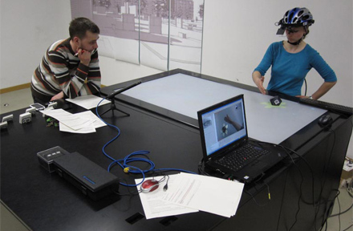
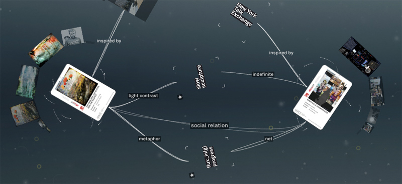
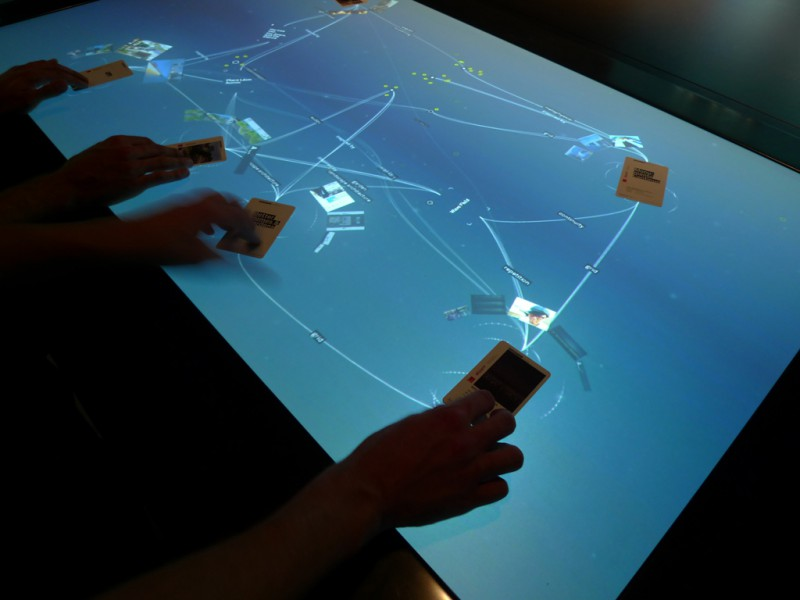
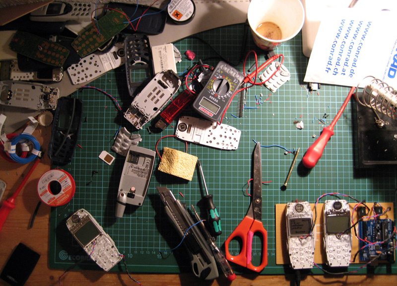

At the <strong>IDL // Interaction Design Lab</strong> senior interaction designer and user experience professionals with years of experience collaborate with master and PhD students from our department of interaction design. The professors from the interface design program guide the projects fullfilling the roles of projectmanager or senior design consultants.

Through our research and development processes the <strong>IDL // Interaction Design Lab</strong> observes and embraces the emerging digital culture, while always trying to take the users perspective. Requirements and wishes, as well as skepticism and fear towards the ongoing digitalisation of our everyday life on the one hand, and the latest technological advances combined with the ever growing masses of data on the other hand present the foundations of our research.

Applying user centered design methods we develop and test prototypes in iterative and often participative processes – and if required – even help taking it a step further and realizing the concept. For the purpose of evaluation, we have a state of the art usability / ux lab at hand, with a stationary and mobile eyetracking suite. Over the years the IDL has established a network of renowned partners in research and industry. Depending on project requirements, we have established a collaborative way of working with those partners on a by project basis.

The areas of research and development at the IDL are manifold. This includes everything from mobile, responsive applications on mobile devices with small displays, as smartphones and wearables, Expert tools from various areas, as well as applications for large displays, e.g. large scale multi touch tables and wall displays. The latter are the subject of research in professional use cases, e.g. Disaster management and urban planning, as well as applications in exhibition contexts.

Over the last few years our applied research had a strong focus on e-Government and opendata portals (e.g. the german agency for the environment, state police of Brandenburg, Fraunhofer Fokus) as well as science communication and visual storytelling (e.g. german archeological institute, helmholtz society, institute for advanced sustainability studies). The goal of the projects is the conception, design and development of user friendly data and information portals for a broad range of target audiences. The up to date information from governmental and research institutions is combined with social media data and provided in raw and visualized formats in the form of maps and data visualizations, to foster the generation of insights and even allow third partys applications to build upon those data driven interfaces.

As part of our official academic research we are looking into innovative forms of human computer interaction with large scale multitouch displays in the context of disaster management as well as dashboards and information visualization for IT security applications.

Further research foci, which are combined under the label of Sustainable Interaction design, adress the transformation towards more sustainable living and working. The mobile application EcoChallenge, is an example for such transformation products, which not only tries to inform users, but to engange them in challenges, which they can solve with their friends.

